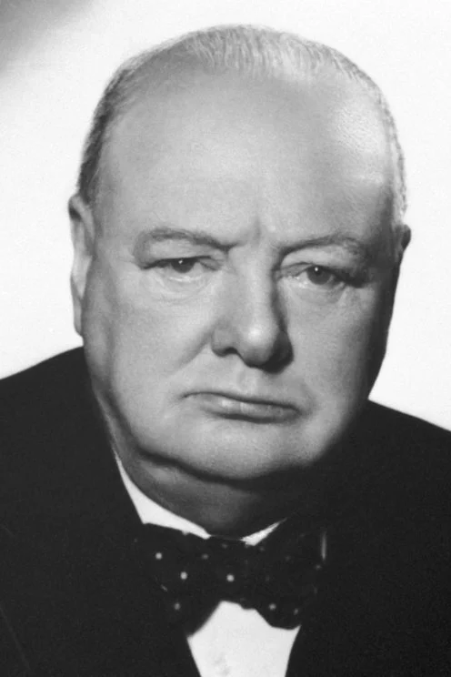
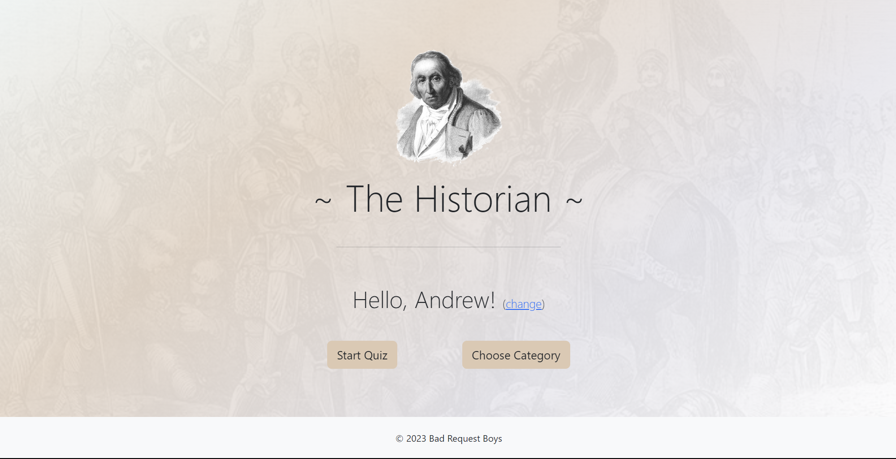
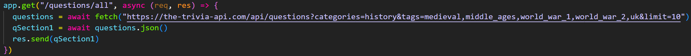
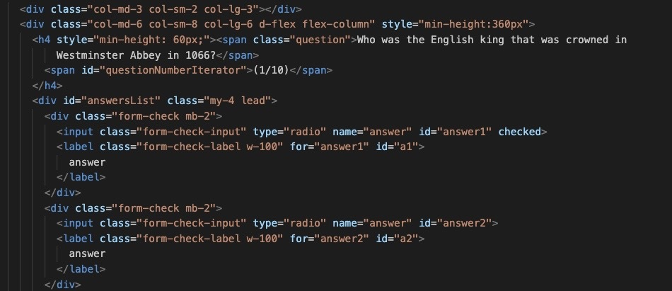
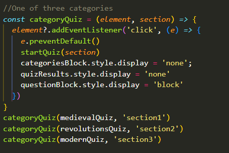
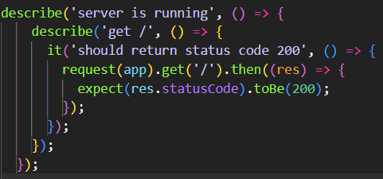

# The Historian - A History Quiz

  

 
## Description

Students have expressed a strong desire for a more engaging approach to learning non-STEM subjects. In response, this project has been developed with the primary goal of making learning enjoyable and interactive for all students. Specifically designed as a history quiz, our project is tailored to benefit key stage 3 students. Our aim is to reinforce the knowledge students acquire in their history lessons by presenting questions related to key subject areas. These topics encompass Medieval history, Revolutions, as well as World War 1 and World War 2.

## Installation and Usage

### Installation
To start this quiz:

* In terminal `git clone` the repository to local machine
* In terminal `npm install` to have all the required packages
* `npm run start` to start the server
* In terminal run `node ./User/Index.html`
* Possible in one line: `npm install && npm run start && node ./User/Index.html`

### Usage

#### HomePage

* Begin by entering your name on the homepage
* You will then be given the option to either initiate a random quiz or select a specific category
* Opting for the "Start Quiz" button will result in a set of random questions from various topics being presented
* If you choose the "Select Category" option, a list of available topics will be displayed
* Upon selecting a particular topic, a quiz containing questions solely from that chosen category will be presented

#### Quiz

* Within the quiz, a question will be shown to the user
* The user will be presented with four answer choices and can click on one to make their selection
* After making a selection, they should click the "Check" button to verify if the chosen answer is correct
* When the answer is correct, it will be displayed in a green color
* To proceed, simply click the "Next Question" button and repeat the same process

#### Incorrect

* In the event of an incorrect answer, the chosen response will be highlighted in red, while the correct answer will be displayed in green
* If you wish to explore the topic further, a link will be available at the bottom of the page
* By clicking on the provided link, you will be directed to the relevant Wikipedia article for additional information
* When you're prepared, click the "Next Question" button to proceed and continue the process

#### End of Quiz

* After completing the quiz, your results will be displayed
* If your score is 7/10 or higher, you will pass the quiz
* If your score is below 7/10, the quiz will be considered failed
* At this point, you have the option to either retake the quiz or return to the homepage

## Technologies 

* Javascript
* BootStrap 5.3.1
* HTML/CSS
* Express JS
* JEST
* SuperTest
* Trivia API

## Process

### Backend

* We initiated the process by searching for a trivia API that offers history-related questions at the following URL: https://the-trivia-api.com/api/questions?categories=history
* Following that, we established the backend functionality by retrieving data from the API
* Next, we identified the pertinent topics from the history API by utilising tags
* Subsequently, we organised distinct sections for each of these topics

### HTML/CSS

* Created relevant html tags with classes and IDs so that they can be used in the frontend code
* Styled all the pages using the latest version of bootstrap - Version 5.3.1

### Frontend

* Created functionality for the buttons
* Made sure a random selection of questions was supplied from the api
* Made sure the answers had randomised positions
* Made sure when check is clicked, if answer is correct, answer appears green
* Made sure when answer is incorrect, incorrect answer appears red, along with correct answer appearing green
* Made sure when answer is incorrect a section appears at the bottom of the screen that takes the user to the relevant Wikipedia article
* Next button takes the user the next question
* After ten questions the user receives a score
* Options to do retake the quiz or go back to the homepage

### Testing

* Used JEST and Supertest to test the functionality of the backend
* Supertest was used to make sure that the server was running as expected
* checked that each section obtained the relevant information and returned an object
